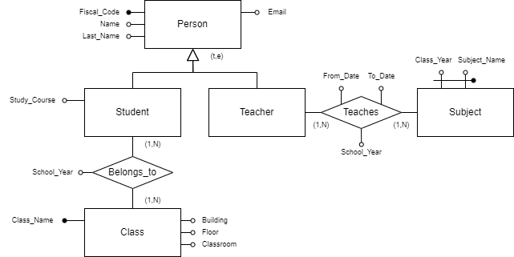

# Logiko

Simple translation tool from E/R models to Logic scheme for high school teaching.

## Installation and Usage

To use the program, it is enough to have Node installed. Download the repository and install the required packages with:

```bash
npm install
```

To run the program, you can either create a model-file or a json model and execute it like this:

```bash
logiko -f [filename]
```

### Options

The program offers the following command-line options:

- `--file` or `-f` to specify the source file for the model (it will automatically understand if the file is in json format from the extension).
- `--verbose` or `-v` to print the explanations of the translation choices.
- `--save-file` or `-s` to save the output on a file. Beware that currently some characters are non-printable (like the underline for the primary key).

## Model file definition

The syntax of a model file is pretty straightforward:

- To give a title to the diagram: `title: <title>`;
- To add comments: `# <comment>`;
- To create an entity: `[<entity_name>] {-k <key_attrs...} {-a <attributes...>}`;
- To create a generalization: `[parent] <-(<cov>,<excl>)- [<child_1>]{, [<children...>]}`;
- To create a relation: `[<e1>]-(<min_c_1>,<max_c_1>)-<name>-(<min_c_2>,<max_c_2>)-[<e2>] {-k <key_attrs...} {-a <attributes...>}`.

### Example:

The following example, although it doesn't make much sense, showcases a possible model-file structure.

```er
# This is a showcase of some instructions
title: Demonstration

# Entities
[Person] -k Fiscal_Code -a Name, Last_Name, Email
[Student] -a Study_Course
[Teacher]
[Subject] -k Subject_Name, Class_Year
[Class] -k Class_Name -a Building, Floor, Classroom

# Generalization
[Person] <-(t,e)- [Student], [Teacher]

# Relations
[Teacher]-(1,n)-Teaches-(1,n)-[Subject] -k School_Year -a From_Date, To_Date
[Student]-(1,n)-Belongs_to-(1,n)-[Class] -k School_Year
```



For further examples refer to the `examples` and `build` folders.

## Limitations

As of now, the program is unable to change the name of attributes, this leads to some undesirable results such as duplicate foreign keys like in the Car Pooling example on the "Viaggio" table. With 1:1 relations, a default policy is used, thus the result may vary based on the order in which the relation is written in the model file. The logic of translation behind generalizations may also fail in some very specific cases.
